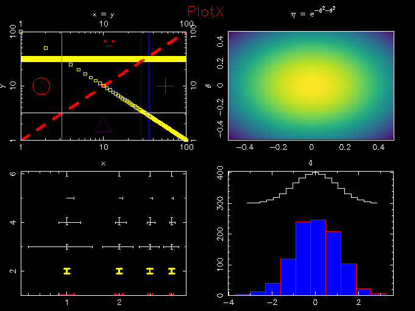

# PlotX
This is a matplotlib-like c++ wrapper for pgplot!

## Dependencies
- pgplot

## Install
- ./bootstrap
- ./configure --prefix=[install_path]
- make
- make install

## Usage
- Check examples directory for some [examples]examples/example.cpp).

